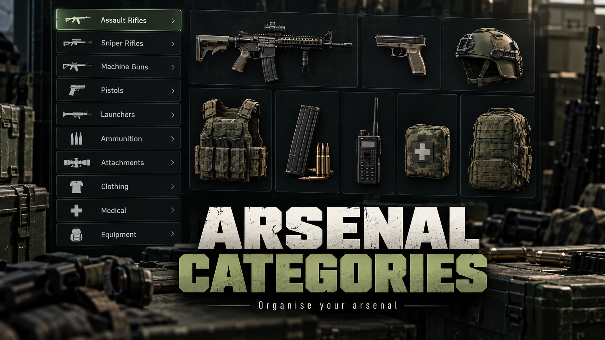

# Arsenal Categories



A small, open-source category sidebar and item-visibility filter for the Arma Reforger arsenal panel.

Source: https://github.com/eduvhc/arsenal-categories

Vanilla lists every item an arsenal offers in one flat grid. This addon adds a category column next to that grid, each button showing its item count, so you only scroll through what you are looking for. It works with any arsenal box (vanilla, RHS, WCS, …) because it hooks the shared arsenal UI rather than any faction's data.

The 39 default categories, in display order (empty ones are hidden, so a vanilla-only arsenal shows far fewer):

| Group | Categories |
|---|---|
| Weapons | Submachine Guns · Shotguns · Grenade Launchers · Assault Rifles · Sniper Rifles · Machine Guns · Pistols · Launchers |
| Ammunition | Vehicle & Aircraft · Rockets & Shells · Launcher Rounds · Magazines |
| Attachments | Optics · Muzzle Devices · Lasers & Lights · Grips & Bipods · Attachments |
| Throwables | Grenades · Smokes & Signals · Explosives |
| Clothing | Helmets · Face & Eyewear · Headwear · Jackets & Shirts · Trousers · Boots & Gloves · Vests · Pouches & Plates · Backpacks |
| Equipment | Medical · Navigation · Binoculars & Rangefinders · Radios · Night Vision · Flares & Lights · Tools & Kits · Deployables · Patches · Equipment |

*Navigation* is map, compass, GPS, watch, DAGR and ballistic tables; *Tools & Kits* is repair/rearming kits, entrenching tools, mine flags and jerrycans; *Deployables* is mortar and tripod parts, sandbags and barbed tape. The set was checked against every vanilla and RHS catalog entry (about 3 000 prefabs): nothing lands in *Other*.

## Requirements

- Arma Reforger. No other dependency.

Load it on the server like any other addon; clients receive it automatically. Without a `visibility` list it only touches the client UI — nothing changes in catalogs, prices or availability, and no prefabs are modified, so it coexists with arsenal content mods.

## What it does

- Replaces the Vicinity panel with a **wide arsenal panel** while an arsenal is open (the "Open Arsenal" view), WCS-style: the category list sits inside the panel on the left (wrapping into more columns when long) and the item grid next to it is 8 columns wide instead of 6. Only categories that actually contain something in that arsenal get a button, each with its count; an *Other* button appears when items match no category.
- Only that one panel uses the addon's layout (swapped in `SCR_InventoryMenuUI.ShowVicinity`, the same way WCS does it); no vanilla layout is overridden by GUID, so backpacks, vests and crates keep the vanilla panel. With `"widePanel": false` the vanilla panel is used and the category column is inserted into the inventory's content row to its left; if even that row is missing (another mod replaced the main layout) the buttons fall back to a two-column block above the grid — the feature never disappears.
- Optional server-enforced hiding of items (e.g. RHS only, keep vanilla medical) via the same JSON.
- Filtering re-uses the vanilla item list (`SCR_ArsenalComponent.GetFilteredArsenalItems`), so supply costs, rank locks and enabled item types keep working exactly as before.
- Works in both places an arsenal can be listed: browsed from the **Vicinity** panel (the normal "Open Arsenal" flow) and opened as its own column.
- Buttons are the vanilla `WLib_ButtonTextImage` widget (icon + caption), so mouse, keyboard and gamepad navigation behave like the rest of the inventory.

## Customising the categories

### Server admins: JSON, no Workbench needed

On first start the server writes its current categories to

```text
$profile:ArsenalCategories/categories.json
```

(the `-profile` directory of a dedicated server; `Documents\My Games\ArmaReforger\profile` for a hosted game or Workbench play). The generated file already contains every default category and an empty `"visibility": []`, so it doubles as the reference for the format. Edit it, restart the scenario, and every player receives the new list when they spawn — clients never need to touch anything. A copy of the default file is in `Docs/categories.example.json`. Invalid JSON or an unknown type/mode name is reported in the server log (`[ARC] ...`) and the file is not pushed, so a typo can never break the arsenal; players fall back to the addon's built-in list.

```json
{
  "categories": [
    {
      "name": "Submachine Guns",
      "icon": "{71648F15B3984B87}UI/Textures/Editor/Attributes/Arsenal/Attribute_Arsenal_AssaultRifles.edds",
      "itemTypes": ["RIFLE"],
      "itemModes": [],
      "itemModesExclude": ["AMMUNITION", "ATTACHMENT"],
      "prefabContains": ["/smg", "_smg", "_mp5", "_mpx"],
      "prefabExcludes": []
    }
  ]
}
```

The optional `"layout"` object shapes the panel (values are clamped to sane ranges; missing keys keep these defaults):

```json
"layout": { "widePanel": true, "columns": 8, "rows": 8, "categoriesPerColumn": 11, "categoryWidth": 200 }
```

| Key | Meaning |
|---|---|
| `widePanel` | `true` = wide arsenal panel with the categories inside it; `false` = vanilla panel, categories in a column to its left |
| `columns`, `rows` | Item grid size of the wide panel (vanilla: 6 × 8) |
| `categoriesPerColumn` | Category buttons per column before wrapping into the next |
| `categoryWidth` | Button width in pixels |

Category keys:

| Key | Meaning |
|---|---|
| `name` | Button caption |
| `icon` | Icon resource (`{GUID}path.edds`); reuse the vanilla arsenal icons from the example, or `""` for none |
| `itemTypes` | `SCR_EArsenalItemType` names; `[]` = any type |
| `itemModes` | `SCR_EArsenalItemMode` names; `[]` = any mode |
| `itemTypesExclude`, `itemModesExclude` | Types / modes that never belong to the category. Weapon categories use `itemModesExclude: ["AMMUNITION", "ATTACHMENT"]` rather than requiring `WEAPON`, because some mods leave weapons on the default mode |
| `prefabContains` | Prefab path must contain one of these (case-insensitive); `[]` = any |
| `prefabExcludes` | Prefab path must contain none of these |

Types: `RIFLE PISTOL LETHAL_THROWABLE ROCKET_LAUNCHER MACHINE_GUN HEAL BACKPACK SNIPER_RIFLE NON_LETHAL_THROWABLE HEADWEAR TORSO VEST_AND_WAIST LEGS FOOTWEAR RADIO_BACKPACK EQUIPMENT WEAPON_ATTACHMENT EXPLOSIVES HANDWEAR MORTARS HELICOPTER VEHICLE`. Modes: `DEFAULT WEAPON WEAPON_VARIANTS AMMUNITION CONSUMABLE ATTACHMENT SUPPORT_STATION PYLON`.

The same file in a client's own profile is used in single player, or when the server does not push one.

### Hiding items (server-enforced)

The same file can take a `"visibility"` array. Rules are checked top to bottom, the **first matching rule decides**, and an item matching no rule is shown. A rule with no conditions matches everything. Filtering happens inside `SCR_ArsenalComponent` on the server as well as on clients, so a hidden item cannot be taken, bought or resupplied — it is not just hidden in the UI.

| Key | Meaning |
|---|---|
| `action` | `"show"` or `"hide"` |
| `addons` | Item comes from one of these addons — the `ID` in the addon's `addon.gproj` (`ArmaReforger`, `RHS_Core`, `RHS_Content_01`, `RHS_Content_02`, `NCMGPS` …) |
| `addonsExclude` | Item comes from none of these addons |
| `itemTypes`, `itemModes`, `prefabContains`, `prefabExcludes` | As for categories |

**Only RHS gear, plus the vanilla essentials** (`Docs/categories.rhs-only.example.json`):

```json
"visibility": [
  { "action": "show", "addons": ["ArmaReforger"],
    "prefabContains": ["/Medicine/", "/Equipment/Maps/", "/Equipment/Compass/", "/Equipment/Flashlights/",
                       "/Equipment/Radios/", "/Equipment/Binoculars/", "/Equipment/Watches/", "/Equipment/Kits/",
                       "/Equipment/Detonators/", "/Demining/", "/Accessories/ETool", "/Fuel/"] },
  { "action": "show", "addons": ["ArmaReforger"],
    "prefabContains": ["/Equipment/Mortars/", "/Equipment/Tripods/", "/Equipment/BallisticTable/",
                       "/Misc/Sandbags/", "/Misc/BarbedTape/", "/Weapons/Ammo/Ammo_Shell_"] },
  { "action": "show", "addons": ["ArmaReforger"],
    "itemTypes": ["LETHAL_THROWABLE", "NON_LETHAL_THROWABLE", "EXPLOSIVES"] },
  { "action": "show", "addons": ["RHS_Core", "RHS_Content_01", "RHS_Content_02", "NCMGPS"] },
  { "action": "hide" }
]
```

Reads as: keep the vanilla gear RHS has no replacement for (medical, navigation, radios, binoculars, kits, tools, mortars and tripods with their rounds, grenades and mines), keep everything from RHS and Simple GPS, hide the rest — vanilla weapons, magazines, attachments and clothing disappear. Drop the second rule if you do not want mortars.

More recipes (each is one entry of the `visibility` array):

| Goal | Rule |
|---|---|
| Hide one specific item | `{ "action": "hide", "prefabContains": ["Rangefinder_Vector21"] }` |
| Hide vanilla launchers only | `{ "action": "hide", "itemTypes": ["ROCKET_LAUNCHER"], "addons": ["ArmaReforger"] }` |
| Anything not RHS, no exceptions | `{ "action": "hide", "addonsExclude": ["RHS_Core", "RHS_Content_01", "RHS_Content_02"] }` |
| Keep the low-cost variant, hide the rest | `{ "action": "show", "prefabContains": ["_lc.et"] }` followed by `{ "action": "hide", "prefabContains": ["Rangefinder"] }` |

JSON rules: no comments, no trailing comma after the last entry, strings in double quotes. If the file is rejected, the server log shows the reason (`[ARC] ...`) and the previous behaviour stays; the file is never rewritten by the mod once it exists, so your edits are safe.

To find an item's addon or path: the prefab path is what the arsenal shows in the Workbench catalog (`Configs/EntityCatalog/...`); the addon ID is in that addon's `addon.gproj`.

### Modders: the .conf

Categories also exist as `Configs/ArsenalCategories/ARC_ArsenalCategories.conf` (used when no JSON is available). Each entry is a name plus rules; an item must satisfy all of them (a mask of 0 / an empty list means "any"):

| Field | Meaning |
|---|---|
| `m_sName` | Button caption |
| `m_sIcon` | Button icon (`.edds`); the defaults reuse the vanilla arsenal icons |
| `m_eItemTypes` | `SCR_EArsenalItemType` flags the category includes |
| `m_eItemModes` | `SCR_EArsenalItemMode` flags the category includes |
| `m_eItemTypesExclude`, `m_eItemModesExclude` | Flags that never belong to the category |
| `m_aPrefabContains` | Prefab path must contain one of these substrings (case-insensitive) |
| `m_aPrefabExcludes` | Prefab path must contain none of these |

The config's *Layout* category holds the same panel settings as the JSON `layout` object (`m_bWidePanel`, `m_iGridColumns`, `m_iGridRows`, `m_iCategoriesPerColumn`, `m_iCategoryWidth`).

An item lands in the **first** category whose rules it satisfies, so order matters: narrow rules go first. That is how *Submachine Guns*, *Shotguns* and *Grenade Launchers* work — the engine has no such types (mods tag them RIFLE or ROCKET_LAUNCHER), so each matches the broad type **and** a prefab name from a list (`smg`, `_mp5`, `mpx`, … / `shotgun`, `m1014`, … / `gm94`, `m320`, …) and sits above *Assault Rifles*. The same goes for *Optics* / *Muzzle Devices* / *Lasers & Lights* / *Grips & Bipods* above the catch-all *Attachments*, *Helmets* / *Face & Eyewear* above *Headwear*, and *Navigation* / *Radios* / *Night Vision* / … above *Equipment*. Magazines carry the type of their weapon but mode `AMMUNITION`, which is why weapon categories *exclude* the `AMMUNITION` and `ATTACHMENT` modes (rather than require `WEAPON` — RHS leaves some rifles on the default mode) and *Ammunition* requires the mode only. Patterns are anchored where a bare word would hit something else: `_p90` (the 1P90 optic contains `p90`), `_ump` (`pump`).

The same rules let you map any mod's weapons: a category with `m_aPrefabContains {"rhs_"}` groups everything from RHS; `m_aPrefabExcludes` keeps a mod's launchers out of the vanilla one.

Open the config in Workbench to edit with proper enum pickers, or edit the numbers by hand (flags are stored as integer sums). If the config fails to load, the same defaults built into `ARC_ArsenalCategoryConfig.CreateDefault()` are used and `[ARC] Category config unavailable` is logged.

To ship different categories in your own addon, override this config (Resource Browser → right-click → *Override to…*) — the override keeps the same GUID, so the addon picks it up without code changes.

## Layout

```
Scripts/Game/ArsenalCategories/
  ARC_BaseGameMode.c                     server: writes/loads categories.json, pushes it on spawn
  ARC_PlayerController.c                 server->client transport for the JSON (chunked RPC)
  ARC_CategoryJson.c                     JSON parse/write, enum names <-> flags, visibility rules
  ARC_VisibilityRule.c                   one show/hide rule (addon, type, mode, prefab path)
  ARC_ArsenalComponent.c                 modded arsenal: drops hidden items on server and client
  ARC_ArsenalCategory.c                  one category: name, icon, type/mode masks, prefab-name rules
  ARC_ArsenalCategoryConfig.c            config root + built-in defaults
  ARC_ArsenalFilterBar.c                 builds the icon+text button column from vanilla WLib_ButtonTextImage
  ARC_ArsenalFilterController.c          shared: selection state, bar lifecycle, filtered item list
  ARC_InventoryStorageLootUI.c           modded Vicinity panel (arsenal browsed in place)
  ARC_InventoryOpenedStorageArsenalUI.c  modded standalone arsenal column
  ARC_InventoryMenuUI.c                  modded inventory menu: swaps the Vicinity panel for the wide layout
  ARC_LayoutSettings.c                   panel settings (wide panel, grid size, category columns)
Configs/ArsenalCategories/
  ARC_ArsenalCategories.conf             the shipped categories
UI/layouts/Menus/Inventory/
  ARC_InventoryContainerGrid.layout      the wide arsenal panel (vanilla panel + category grid), own GUID
```

Everything new is prefixed `ARC_`, including the members added to the modded classes and the widgets of the panel layout. No vanilla layout or script file is replaced by GUID.

## Testing in Workbench

1. Script Editor → **Validate Scripts (F7)**.
2. Open `worlds/MP/MpTest/MpTest_Basic.ent` (vanilla), create a sub-scene, and add three prefabs: `Prefabs/MP/Modes/Plain/GameMode_Plain.et`, `Prefabs/MP/Managers/Factions/FactionManager_USxUSSR.et` and `Prefabs/Props/Military/Arsenal/ArsenalBoxes/US/ArsenalBox_US.et`. Without the game mode every arsenal is empty (`needs a entity catalog manager!`); without exactly one faction manager the game mode crashes on init (`NULL pointer … m_FactionManager`) or complains `Multiple faction managers present!`.
3. **Play**, walk to the box, *Open Arsenal*. The wide panel opens with the category list on its left. Click through the categories; counts add up to All. Clicking the active category keeps it active.
4. Check the Log Console for `[ARC]`: expect `Server categories loaded`, `Received server categories`, `Using categories pushed by the server`, and no warnings.
5. For RHS or other content mods, open the project with those addons (*Open with Addons*) and repeat with their arsenal boxes.

## License

Arma Public License (APL) — see LICENSE. Not affiliated with Bohemia Interactive.
